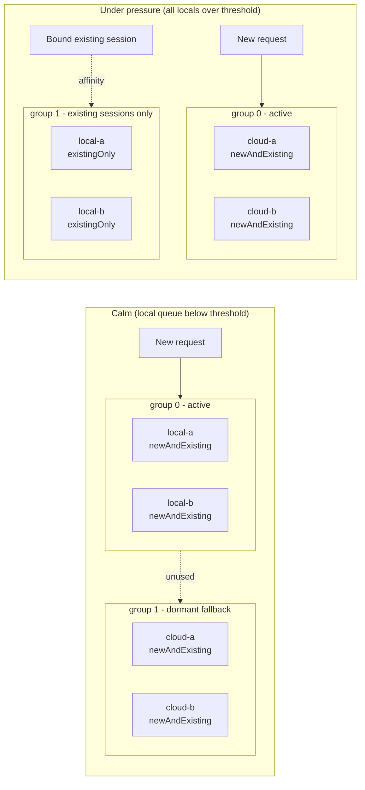

# Provider Selection and Load Balancing

Grid and Praxis divide provider routing into two parts:

- Grid observes provider state asynchronously, decides which providers are
  eligible, orders them, and publishes a versioned routing overlay.
- Praxis consumes that overlay and makes the final request-time choice locally
  in the `intelligent_route` filter.

This separation keeps Kubernetes, Grid reconciliation, EPP metrics, and remote
coordination out of the request hot path.

```text
Client
  |
  v
Consumer gateway
  |
  v
intelligent_route
  |
  v
First viable selection group
  +--> Provider gateway A
  +--> Provider gateway B
  `--> Provider gateway C

Lower-priority group
  `--> Provider gateway D
```

A, B, and C can share active traffic when the selected policy permits it. D is
fallback capacity and is not selected while the earlier group remains viable.
A selection group is a priority and resilience boundary; it is not a score
bucket and does not represent a traffic percentage.

This layer balances requests across provider gateways. After a provider gateway
is selected, its local serving stack can make a separate backend-level decision.
For example, an llm-d provider gateway can delegate endpoint selection to EPP.
Grid does not use round-robin to choose individual inference replicas hidden
behind one provider gateway.

## Choose a configuration

Use these starting points, then adjust them to match the deployment's routing
goal:

| Goal | Routing policy | Scoring strategy | Selection mode |
|---|---|---|---|
| Share traffic across nearby generic providers | `geographyFirst` | `noMetrics` | `roundRobin` |
| Keep nearby providers active and remote providers as fallback | `geographyFirst` | Any | `roundRobin` |
| Send new traffic to the highest-ranked provider | `geographyFirst` or `scoreFirst` | Any | `deterministic` |
| Share traffic across sites without inference metrics | `scoreFirst` | `noMetrics` | `roundRobin` |
| Randomize selection inside the preferred provider group | Either | Any | `random` |
| Distribute by explicit provider capacity | `scoreFirst` | `noMetrics` | `weightedRandom` |

The policy fields answer different questions:

- `routingPolicy`: How are candidates ordered and how are active/fallback
  priority groups formed by default?
- `scoringPolicy`: How should providers be ranked using available metrics?
- `selectionPolicy.grouping`: Which eligible locality tiers may participate in
  one active group?
- `selectionPolicy.mode`: How should Praxis choose within the active group?

## The decision sequence

```text
Request for a capability
  |
  v
Eligibility and admission
  |
  v
Routing policy orders candidates and creates priority groups
  |
  v
Session-affinity lookup
  +-- permitted existing binding -> reuse its provider
  `-- no usable binding -> find the first viable group
                            |
                            v
                          apply the configured selection mode
                              +-- deterministic mode
                              +-- roundRobin mode
                              +-- random mode
                              `-- weightedRandom mode
```

Scores contribute to candidate ordering. They do not create groups. The
selection mode operates only inside the first group that can serve the request.

## Eligibility and admission

Before ordering, Grid builds candidates for the requested capability. The
overlay already reflects capability matching, authorization and trust,
provider health, freshness, and provider availability. Admission is a hard
boundary:

| Admission state | New requests | Existing sessions |
|---|---:|---:|
| `newAndExisting` | Allowed | Allowed |
| `existingOnly` | Not selected | Allowed when the binding is permitted |
| `excluded` | Not selected | Not selected |

An `existingOnly` provider can finish work for a session that is already bound
to it, but it does not receive new bindings. An excluded provider cannot be
selected. Neither scoring nor a selection mode can override these states.

## Routing policy and groups

`spec.routingPolicy` controls candidate ordering and hard priority boundaries.
The supported values are `geographyFirst` and `scoreFirst`. An optional
`selectionPolicy.grouping.localityScope` can deliberately widen the locality
bucket used for active-set membership without changing site identity.

### `geographyFirst`

Candidates are ordered by admission, locality tier, freshness, score, and
deterministic identity tie-breakers. Groups are separated by admission,
locality tier, and freshness. Scores order candidates within a group but do
not split that group.

```text
Closest healthy and fresh tier:  A, B, C  <- active selection
More distant healthy tier:      D, E     <- fallback
```

In plain language: balance within the closest healthy provider tier and use
more distant capacity as fallback. A remote provider does not join local
active traffic merely because its score is higher.

### `scoreFirst`

Candidates are ordered by admission, freshness, score, locality, and
deterministic identity tie-breakers. Groups are separated by admission and
freshness only. Fresh admitted providers from different sites can therefore
share one active group. Score differences affect order, not group membership.

In plain language: allow fresh admitted providers across sites to participate
in the same active traffic group.

### Explicit locality grouping

Use `selectionPolicy.grouping.localityScope` when distinct provider sites are
intended to share active traffic. This is separate from the selection mode and
from provider scoring:

```yaml
spec:
  routingPolicy: geographyFirst
  scoringPolicy:
    strategy: noMetrics
  selectionPolicy:
    mode: weightedRandom
    grouping:
      localityScope: sameRegion
```

Supported scopes are:

| Scope | Active locality bucket |
|---|---|
| `sameSite` | Preserve the legacy same-site boundary |
| `sameZone` | Same-site and same-zone candidates may share a group |
| `sameRegion` | Same-site, same-zone, and same-region candidates may share a group |
| `anyEligible` | Locality does not split eligible candidates |

The grouping policy is applied after capability matching, authorization,
health, freshness, and admission. It never re-admits an `existingOnly`
candidate, and it never merges different capabilities. Backend-class
boundaries remain independent: local/remote candidates can share the selected
locality bucket while `api_provider` and `cloud_managed` candidates remain in
later overflow groups.

Sites, stable IDs, provider gateways, metrics, and admission state remain
distinct. The policy changes only active-set membership. Traffic weights then
control distribution inside the resulting group, and Praxis still selects from
the accepted immutable overlay without a request-time Grid call.

## Scoring policy

`spec.scoringPolicy.strategy` selects the provider-level signal used for score
calculation. It is independent of request-time selection:

- `noMetrics` requires no EPP, Prometheus, or inference-specific metrics.
  Dynamic score contributions are zero, while health, admission, freshness,
  authorization, locality, affinity, and selection policy still apply. This is
  the normal choice for generic or heterogeneous provider gateways. Use it when
  llm-d EPP metrics are unavailable or are not comparable across providers.
- `queueDepth` uses asynchronously observed, normalized provider-pool queue
  pressure. Lower pressure produces a higher preference score. It requires
  comparable queue metrics and a meaningful queue capacity. For an llm-d
  provider, Grid retrieves this signal from the configured EPP metrics endpoint.
- `kvCachePressure` uses provider-level KV-cache utilization as a capacity
  pressure signal. Lower utilization produces a higher score. It is not
  request-specific prefix-cache affinity; that decision belongs inside the
  inference scheduler. For an llm-d provider, Grid retrieves this signal from
  the configured EPP metrics endpoint.

Grid currently uses one explicitly selected strategy rather than blending
unrelated signals into an opaque total. Missing local samples can use the
implementation's neutral fallback values, and a recent local sample can be
reused while it remains within `staleMetricsSeconds`. Deployments using a
metric strategy should provide fresh, comparable telemetry for every competing
provider.

The important rule is:

```text
score != traffic weight
```

Scores are preference and observability signals. They do not turn a score of
`0.8` versus `0.4` into a 2:1 traffic split. With `roundRobin`, candidates in
the active group receive equal turns regardless of their scores.

For detailed metric input and normalization, see [Provider Scoring](scoring.md).

## Selection policy

`spec.selectionPolicy.grouping` controls active-set membership and
`spec.selectionPolicy.mode` controls request-time selection inside the first
viable group. The selection mode is applied from an accepted in-memory
snapshot by Praxis; Grid is not called for each request.

### `deterministic`

Selects the first viable candidate in the active group. This is strict
preference behavior: Grid's ordering determines which provider receives new
unbound traffic. It is useful when locality, score, primary/standby order, or
predictability should dominate. When `selectionPolicy` is absent from an
overlay, Praxis uses `deterministic`.

### `roundRobin`

Takes equal turns across viable candidates in the active group. It does not
require inference metrics and does not distribute across lower-priority groups
while the active group is viable. It balances selections, not necessarily
tokens, latency, request cost, or concurrent work. Session affinity is checked
before this mode runs.

### `random`

Selects uniformly from viable candidates in the active group. It follows the
same admission, group, and affinity rules as round-robin. Random state is local
to the gateway process and is not a global coordinator.

### `weightedRandom`

Selects from viable candidates using explicit overlay weights. It requires a
placement policy and is the only current mode that turns provider capacity
configuration into unequal selection probability. The weights are bounded and
precomputed when Praxis loads the snapshot; no request-time metrics lookup is
performed.

## Policy matrix

| Routing policy | Selection policy | Effective behavior |
|---|---|---|
| `geographyFirst` | `deterministic` | Strict preference for the highest-ranked provider in the closest viable tier |
| `geographyFirst` | `roundRobin` | Equal selection in the closest viable tier; remote tiers are fallback |
| `geographyFirst` | `random` | Uniform selection in the closest viable tier |
| `scoreFirst` | `deterministic` | Strict preference for the highest-ranked fresh admitted provider across sites |
| `scoreFirst` | `roundRobin` | Equal selection across fresh admitted providers in the active group |
| `scoreFirst` | `random` | Uniform selection across fresh admitted providers in the active group |
| `scoreFirst` | `weightedRandom` | Explicit weighted selection across fresh admitted providers in the active group |

The scoring strategy changes ordering, not the selection mode:

| Scoring strategy | Metrics required | Deterministic | Round-robin |
|---|---|---|---|
| `noMetrics` | No | Ordering and deterministic tie-breaks decide | Equal selection inside the active group |
| `queueDepth` | Compatible queue metrics | Highest queue-based preference is first | Scores remain visible; selection remains equal |
| `kvCachePressure` | Compatible KV metrics | Highest available-capacity preference is first | Scores remain visible; selection remains equal |

## Configuration examples

### Generic provider-gateway balancing

```yaml
apiVersion: grid.praxis-proxy.io/v1alpha1
kind: GridNetwork
metadata:
  name: provider-grid
spec:
  routingPolicy: geographyFirst
  scoringPolicy:
    strategy: noMetrics
  selectionPolicy:
    mode: roundRobin
```

Providers in the nearest viable group share selections equally. No inference
metrics are required, and remote groups remain available for fallback.

### Strict metric preference

```yaml
apiVersion: grid.praxis-proxy.io/v1alpha1
kind: GridNetwork
metadata:
  name: inference-grid
spec:
  routingPolicy: scoreFirst
  scoringPolicy:
    strategy: queueDepth
  selectionPolicy:
    mode: deterministic
  metricsRefreshInterval: "10s"
```

Grid refreshes the selected signal asynchronously. Deterministic selection
uses the resulting ordering; it does not query EPP during a request.

### Cross-site active/active selection

```yaml
apiVersion: grid.praxis-proxy.io/v1alpha1
kind: GridNetwork
metadata:
  name: active-active-grid
spec:
  routingPolicy: scoreFirst
  scoringPolicy:
    strategy: noMetrics
  selectionPolicy:
    mode: roundRobin
```

Fresh, admitted providers from multiple sites can share the active group.

### Random selection

```yaml
apiVersion: grid.praxis-proxy.io/v1alpha1
kind: GridNetwork
metadata:
  name: random-provider-grid
spec:
  routingPolicy: geographyFirst
  scoringPolicy:
    strategy: noMetrics
  selectionPolicy:
    mode: random
```

Random selection is uniform within the active group. It is useful when an
equal probabilistic distribution is sufficient and a repeating sequence is not
required.

### Explicit weighted selection

```yaml
apiVersion: grid.praxis-proxy.io/v1alpha1
kind: GridNetwork
metadata:
  name: weighted-provider-grid
spec:
  routingPolicy: scoreFirst
  scoringPolicy:
    strategy: noMetrics
  placementPolicy:
    strategy: static
  selectionPolicy:
    mode: weightedRandom
```

Set `capacityWeight` to values such as `60`, `30`, and `10` on the matching
`InferenceProvider` resources. The placement policy is explicit; weighted
selection is never inferred from scores or metric availability.

## Request-time behavior and affinity

For a new request, Praxis reads the accepted snapshot, resolves the requested
capability, checks affinity, finds the first viable group, applies the selection mode,
and records a binding when the selection succeeds.

```text
Client
  |
  | request
  v
Consumer gateway / intelligent_route
  | 1. Read accepted in-memory overlay
  | 2. Resolve capability and eligibility
  | 3. Check session affinity
  | 4. Find the first viable group
  | 5. Apply the configured selection mode
  | 6. Record the successful binding
  v
Selected provider gateway
  |
  v
Provider backend
```

For an existing permitted binding, no new selection mode is applied:

```text
Client with an existing session
  |
  v
intelligent_route
  |
  | permitted affinity binding found
  v
Previously selected provider
```

Round-robin does not move an established session just to improve aggregate
balance. The observed request distribution can therefore differ from an exact
split when sessions generate different amounts of traffic.

## Cloud burst and overflow behavior

Cloud burst is not a separate mechanism. It is the emergent result of admission,
grouping, and affinity working together. There is no "burst percentage" knob.

For example, a network with two local providers and two overflow (cloud) providers
behaves like this as local queue pressure crosses the admission threshold:



New/unbound traffic always follows the first viable group; the group numbers re-flow
as admission changes. Established sessions stay pinned by affinity even after their
provider becomes `existingOnly`.

**Overflow providers sit in a fallback group.** A cloud/overflow provider is a more
distant locality tier (for example `cross_region`) and/or a different backend class,
so under `geographyFirst` it lands in a later group than the local providers. In the
calm state every provider is `newAndExisting`, and Praxis serves new traffic from the
local group, so the overflow group is dormant:

```text
Calm:   group 0  local-a, local-b   (newAndExisting)  <- all new traffic
        group 1  cloud-a,  cloud-b   (newAndExisting)  <- dormant
```

**Admission is what triggers burst.** `derive_admission_state` marks a provider
`existingOnly` when its normalized `queue_depth > 0.85` **or** `kv_cache_utilization
> 0.90` (absent metrics stay `newAndExisting`). When a local provider crosses that
line it stops receiving new bindings. Because `newAndExisting` sorts before
`existingOnly`, the group numbering re-flows: the still-fresh overflow candidates
become the first viable group for new traffic, and the saturated locals fall to a
later group.

```text
Pressure: group 0  cloud-a, cloud-b   (newAndExisting)  <- new traffic bursts here
          group 1  local-a, local-b   (existingOnly)    <- existing sessions only
```

The group *numbers* are positional (best-viable-group ordering), not identity. Cloud
appearing as group 0 under pressure is correct behavior, not a grouping bug.

**Burst affects new/unbound traffic; affinity pins healthy existing sessions.**
Affinity is resolved before selection (see the sequence above), and an `existingOnly`
provider still serves sessions already bound to it. So during a transition:

- existing healthy sessions stay on their current (local) provider;
- new/unbound sessions use the first viable group, which is now the overflow group.

This is why burst is transitional rather than a mass migration: established sessions
keep using local capacity while new sessions overflow.

**Overflow is all-or-nothing across the local group, not a proportional split.**
Selection weights (when configured) distribute traffic *within* a single group; they
never split traffic across groups. Consequently:

- while **at least one** local provider is `newAndExisting` (below the thresholds),
  **all** new traffic stays local and the overflow group stays dormant;
- once **every** local provider is `existingOnly`, **all** new traffic goes to the
  overflow group.

There is no state in which new traffic is simultaneously split, say, 80% local / 20%
cloud — locals and cloud are in different groups. To keep some new traffic local
during a pressure test, keep at least one local provider below the queue-depth
threshold (for example a normalized queue of 0.80 with a 0.85 threshold); driving all
locals to 0.90 sends 100% of new traffic to the overflow group. A proportional spill
would require an explicit partial-overflow placement policy and is not the current
default.

### Connection settings for cloud/API providers

Overflow providers are typically remote HTTPS endpoints (for example an
OpenAI-compatible API). The provider gateway pools and reuses upstream keep-alive
connections to them, which is good for latency but exposes a race: a bursty upstream
sees idle gaps between bursts, the remote server closes idle connections on its side,
and the next request written onto a reused-but-closed connection fails with a
`Connection reset by peer` while reading response headers, surfaced as an HTTP 502.

To avoid this, set an idle-connection timeout on the cloud upstream cluster that is
**shorter than the provider's server-side idle close**, so the gateway recycles idle
connections before the remote end does. `idle_timeout_ms` is a per-cluster field; when
unset the built-in timeout is used, which is usually too long for a bursty cloud
upstream.

```yaml
- filter: load_balancer
  clusters:
    - name: openai-overflow
      authority: api.openai.com
      endpoints: ["api.openai.com:443"]
      tls:
        sni: api.openai.com
        verify: true
      connection_timeout_ms: 5000
      idle_timeout_ms: 5000     # recycle idle conns before the provider closes them
```

Guidance:

- Choose `idle_timeout_ms` conservatively below the provider's observed idle-close
  window (a few seconds is a safe starting point for public LLM APIs). This shrinks
  the reuse race window without giving up connection pooling.
- Do **not** solve this by disabling connection reuse entirely
  (`runtime.upstream_keepalive_pool_size: 0`) except as a last resort — it forces a
  full TLS handshake on every request.
- A bounded idle timeout mitigates but does not fully close the race. The complete fix
  is to safely retry a reset that occurs on a *reused* connection before any response
  byte (a first delivery on a fresh connection, safe even for non-idempotent methods);
  configure `retriable_conditions` to include `reset` on such clusters where the
  gateway build supports reused-connection-aware retries.

## Multiple consumer gateways

The design supports multiple consumer gateways. Each gateway receives an
accepted overlay snapshot and keeps its own local selection state:

```text
                 Grid overlay
                /            \
               v              v
      Consumer gateway 1   Consumer gateway 2
        local counter        local counter
          A -> B -> C          A -> B -> C
```

Counters are not coordinated globally. Each gateway can produce a balanced
local sequence, while aggregate traffic depends on request rates, affinity,
restarts, and snapshot replacement. A globally synchronized quota would need
a different coordination design and would add hot-path trade-offs.

## Overlay lifecycle and re-ranking

```text
Provider health and optional EPP metrics
  |
  v
Grid operator reconciliation
  | eligibility, admission, ordering, scores, groups, selection policy
  v
Content-addressed routing overlay
  |
  v
overlay-sync validation and publication
  |
  v
Praxis validates and atomically loads a snapshot
  | precomputed group index and local selection state
  v
Request-time selection from memory
```

Reconciliation is triggered by watched provider, site, and network changes,
remote Grid state, and the periodic `metricsRefreshInterval`. The default
periodic cadence is 300 seconds for plaintext metrics; TLS-protected metrics
use a 60-second safety cap. A configured interval must be at least one second.
The interval controls observation and overlay publication, not request-path
latency. A demo or operator can cause an earlier reconcile through a real
watched resource change.

After an overlay is accepted, requests do not call Grid, Kubernetes,
ConfigMaps, EPP, Prometheus, or a remote scoring service. An unchanged semantic
revision should not continually rebuild selection state. An accepted semantic
change may create fresh snapshot-scoped state.

## Failure and fallback

Grid observes health, admission, freshness, and optional metrics
asynchronously. Praxis serves from the last accepted snapshot until a valid
new overlay is delivered. An unavailable or excluded provider cannot receive
new selections, and the first viable group is preferred. Later groups are
fallback capacity, not part of normal active distribution.

Failover is therefore bounded by observation, reconciliation, overlay
distribution, and snapshot acceptance. It is not an immediate request-time
call to Grid. A request already sent upstream can fail before a newer snapshot
is accepted; do not assume automatic retry unless the gateway configuration
explicitly provides it.

## Overlay contract and weighted placement

`selectionPolicy` and its nested `grouping` policy are optional in both the
Grid API and the overlay. An omitted grouping field preserves legacy grouping
exactly. An omitted selection policy remains omitted, and Praxis interprets it
as deterministic selection.
The Helm chart explicitly renders `roundRobin` by default. Users applying a
`GridNetwork` directly can either set the selection mode explicitly or omit the policy
to select `deterministic`.

`selection_group` and `selection_policy` are part of the semantic digest when
present. Group numbers are zero-based and contiguous per capability. Unknown
mode values and malformed policy structures are rejected. Overlays without
the optional selection fields remain valid and use deterministic selection.

`weightedRandom` is an explicit selection mode. It requires a placement policy
and an explicit provider weight in the overlay. The supported static placement
strategy derives those weights from each `InferenceProvider.spec.capacityWeight`
value, bounded to 1 through 1000; omission defaults to a weight of 1. An equal
placement strategy assigns the same weight to each eligible provider.

Weighted selection changes distribution inside the first viable group only. It
does not make lower-priority groups active, bypass admission or freshness, or
turn score values into weights. `queueDepth` and `kvCachePressure` remain
preference signals and do not implicitly enable weighted selection.

Metric-derived weighting remains a future extension. It would need explicit
normalization, missing-metric behavior, bounds, and stability controls, and it
must not change admission, locality, authorization, freshness, or group
boundaries.

## Demonstration reference

The [Grid provider-selection research spike](https://github.com/praxis-proxy/grid/issues/31)
describes the focused provider-traffic demonstrations: one consumer gateway,
three provider gateways, and an active selection group. The equal-selection
variant uses `noMetrics` and `roundRobin`; the weighted variant uses explicit
static capacity weights and `weightedRandom`. These proofs demonstrate local
provider selection, not coordinated round-robin across multiple consumers,
retry behavior, or fallback groups unless separate evidence is provided.
