# Grid Routing Guide

Grid routes inference traffic across provider gateways using a **multi-dimensional policy** rather than a single load-balancing algorithm. This guide starts with the routing outcome you want, then shows how policy, scoring, groups, affinity, and selection mode work together.

The practical model is:

1. Determine which providers are eligible to receive the request.
2. Order eligible providers and form **selection groups**.
3. Reuse an existing provider when session affinity permits it.
4. Find the **first viable selection group**.
5. Apply the configured selection mode inside that group.
6. Forward the request to the selected provider gateway.
7. Let the provider-local serving stack, such as llm-d/EPP, make any separate pod-level or replica-level decision.

Grid makes control-plane decisions asynchronously and publishes a versioned routing overlay. Praxis loads that overlay and makes the final request-time provider choice locally. Grid, Kubernetes, Prometheus, and EPP are not consulted synchronously for every request.

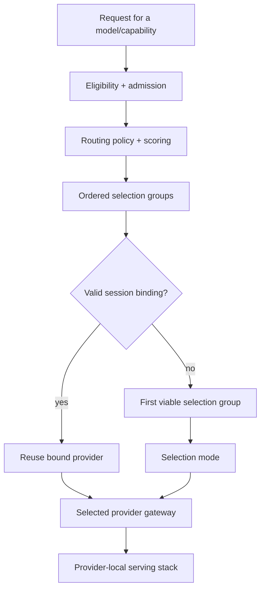

The most important distinction is:

> **Selection groups decide who is allowed to compete together. Selection mode decides how Praxis chooses among providers inside the active group. Scoring influences preference/order. Weights influence proportional selection. These are different controls.**

## Start with the routing need

| Routing need | Primary configuration | What it does |
|---|---|---|
| Keep traffic close and use remote capacity only as fallback | `routingPolicy: geographyFirst` | Creates locality-based priority groups. |
| Always choose the highest-ranked eligible provider | `selectionPolicy.mode: deterministic` | Picks the first provider in the active group. |
| Spread requests evenly | `selectionPolicy.mode: roundRobin` | Rotates new, unbound requests across providers in the active group. |
| Spread requests without a repeating sequence | `selectionPolicy.mode: random` | Uniform random choice within the active group. |
| Send more requests to providers with greater configured capacity | `selectionPolicy.mode: weightedRandom` + `placementPolicy.strategy: static` + provider `capacityWeight` | Samples providers proportionally within the active group. |
| Let providers in different sites actively share traffic | `routingPolicy: scoreFirst` | Allows fresh, admitted providers across sites to participate in one active group. |
| Prefer the provider with less queue pressure | `scoringPolicy.strategy: queueDepth` + usually `routingPolicy: scoreFirst` | Changes provider ranking based on asynchronously observed queue depth. |
| Prefer the provider with more free KV-cache capacity | `scoringPolicy.strategy: kvCachePressure` + usually `routingPolicy: scoreFirst` | Changes provider ranking based on provider-level KV-cache pressure. |
| Stop new sessions going to a pressured provider | Stabilized admission plus a pressure signal | Moves pressured providers to `existing_only`; requires an active scoring strategy and matching provider metric signal. |
| Keep an existing session on the same provider | Praxis AI `session_affinity` | Reuses the bound provider before running a new selection. |
| Change routing without restarting Praxis | Grid overlay publication + Praxis overlay hot reload | Atomically replaces the accepted routing snapshot. |

For the low-level overlay, revision, delivery, credential, and provider-hop contracts, see [Routing Architecture and Overlay Contract](architecture/routing.md).

For metric collection and normalization details, see [Provider Scoring](architecture/scoring.md).

Configuration snippets show the routing settings to add to an existing
deployment. Provider snippets are partial resources: retain the required
`backendKind`, `providerKind`, and `endpoint`, along with the capability,
site, trust, and authentication settings for your deployment. See the
[CRD Reference](architecture/crds.md) for complete resource examples.

If `selectionPolicy` is omitted, Praxis uses deterministic selection. Set it
explicitly when you want traffic sharing; `noMetrics` alone does not enable
round robin or weighted selection.
The `grid-site` Helm chart explicitly sets `roundRobin` for a new network
unless configured otherwise; it preserves an existing network's selection
policy on upgrade. Check the rendered resource when comparing Helm and direct
CR installations.

---

# 1. Selection groups: the foundation

A **selection group** is a priority and resilience boundary.

Providers in the same active group may share new traffic according to the configured selection mode. Providers in lower-priority groups are fallback capacity and do not participate while an earlier group remains viable.

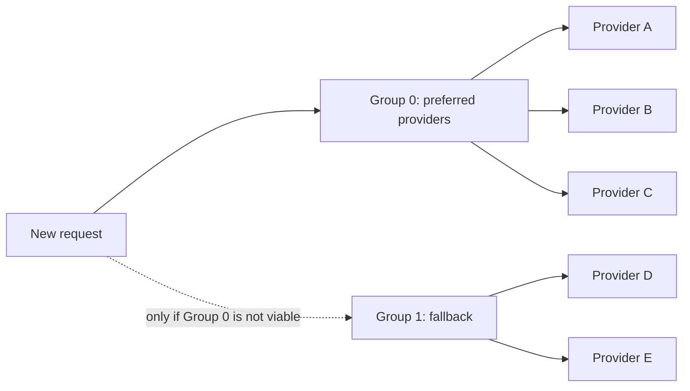

Think of this as two separate questions:

```text
Which group is active?
        ->
How do I select inside that group?
```

A 50/30/20 weighted policy in Group 0 does **not** mean 50/30/20 across Group 0 and all fallback groups. The weights apply only among eligible candidates in the first viable group.

Likewise, a provider with a very good score in a lower-priority group does not automatically join the active group when the routing policy keeps that group separate.

## `geographyFirst`: local-first selection groups

Use this when the need is:

> Keep requests on the closest healthy capacity and use farther capacity only when the closer tier cannot accept the request.

`geographyFirst` orders candidates by admission, locality, freshness, score, and deterministic tie-breakers. Groups are separated by admission state, locality tier, and freshness; scores only order providers within a group.

Upgrade note: omitting `selectionPolicy` means deterministic selection, but the
first candidate can still change when Grid's ordering changes, including when
freshness differs. If a fixed primary matters, set the policy explicitly and
compare the rendered routing overlay before and after an upgrade.

For providers with the same admission state and freshness, the locality tiers
look like this (group numbers are illustrative, not fixed locality IDs):

```text
Group 0  same-site healthy providers     <- active
Group 1  same-zone providers             <- fallback
Group 2  same-region providers           <- fallback
Group 3  cross-region providers          <- fallback
```

Example:

```yaml
apiVersion: grid.praxis-proxy.io/v1alpha1
kind: GridNetwork
metadata:
  name: local-first
spec:
  routingPolicy: geographyFirst
  scoringPolicy:
    strategy: noMetrics
  selectionPolicy:
    mode: roundRobin
```

With two eligible local providers, requests rotate between those local providers. A remote provider remains fallback while the local group is viable.

**Demonstrated by:**

- [Grid Combined-Site Demo](https://github.com/praxis-proxy/demos/tree/main/demos/grid-combined-site): local provider preference, remote-provider fallback after local withdrawal, and recovery.
- [Grid Workload Inference Demo](https://github.com/praxis-proxy/demos/tree/main/demos/grid-workload-inference): health/locality failover for cluster-local workloads.
- [Grid Regional Failover and Cloud Burst](https://github.com/praxis-proxy/experimental/tree/main/demos/grid-cloud-burst): site-local groups, regional fallback, and an external overflow group.

## `scoreFirst`: cross-site active selection

Use this when the need is:

> Let fresh, admitted providers in different sites actively compete instead of treating locality as a hard fallback boundary.

`scoreFirst` groups providers by admission state and freshness, regardless of site. Fresh providers admitted for new work can therefore share one group across sites. Scores affect their ordering; locality becomes a tie-breaker rather than a group boundary. Stale or existing-session-only candidates remain in separate groups.

```yaml
apiVersion: grid.praxis-proxy.io/v1alpha1
kind: GridNetwork
metadata:
  name: cross-site-active
spec:
  routingPolicy: scoreFirst
  scoringPolicy:
    strategy: noMetrics
  selectionPolicy:
    mode: roundRobin
```

This produces equal request selection across fresh admitted providers in the active group, even when those providers are in different sites.

**Demonstrated by:**

- [Grid LLM-d Pool Metrics Demo](https://github.com/praxis-proxy/demos/tree/main/demos/grid-llmd-pool-metrics): uses `scoreFirst` so a better provider score can outrank locality.

Experimental cloud-burst work explores explicit locality grouping. That work is
not part of the stable GridNetwork API; use the stable `routingPolicy` values
documented here for mainline deployments. See the
[experimental cloud-burst demo](https://github.com/praxis-proxy/experimental/tree/main/demos/grid-cloud-burst)
for its current status and requirements.

---

# 2. Deterministic selection

Use this when the need is:

> Always send a new request to the highest-ranked eligible provider.

Deterministic mode selects the first provider after Grid has ordered the active group.

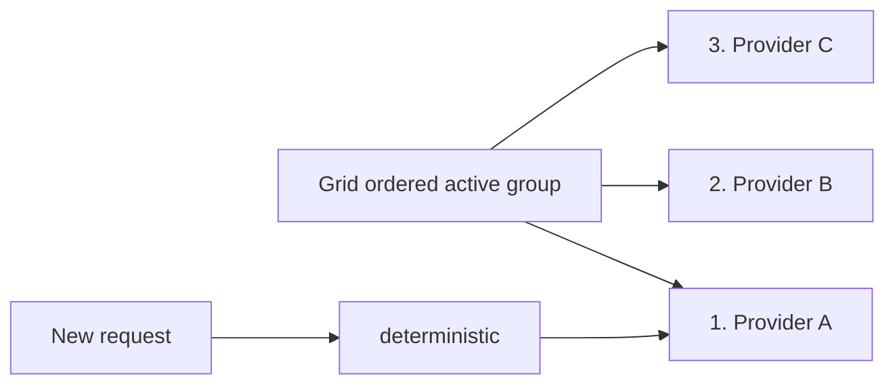

Configuration:

```yaml
apiVersion: grid.praxis-proxy.io/v1alpha1
kind: GridNetwork
metadata:
  name: strict-preference
spec:
  routingPolicy: geographyFirst
  scoringPolicy:
    strategy: noMetrics
  selectionPolicy:
    mode: deterministic
```

This is useful for:

- strict primary/preferred provider behavior;
- making Grid's score/order directly determine the selected provider;
- predictable primary/fallback behavior.

A particularly useful combination for load-sensitive preference is:

```yaml
apiVersion: grid.praxis-proxy.io/v1alpha1
kind: GridNetwork
metadata:
  name: least-pressured-first
spec:
  routingPolicy: scoreFirst
  scoringPolicy:
    strategy: queueDepth
  selectionPolicy:
    mode: deterministic
  metricsRefreshInterval: "10s"
```

Grid asynchronously ranks the provider pools. Praxis then chooses the first provider from the accepted snapshot. Praxis does not query EPP during the request.

**Demo coverage:** deterministic selection is a supported mode, but the current demo set does not have a demo whose sole purpose is deterministic selection. The load-aware metrics demo is useful for understanding the ranking input that deterministic mode can consume.

---

# 3. Round-robin selection

Use this when the need is:

> Spread new requests evenly and predictably across equivalent providers.

Round robin takes equal turns among eligible providers inside the first viable selection group.

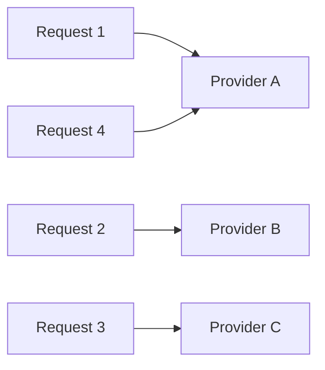

Configuration:

```yaml
apiVersion: grid.praxis-proxy.io/v1alpha1
kind: GridNetwork
metadata:
  name: even-local-balancing
spec:
  routingPolicy: geographyFirst
  scoringPolicy:
    strategy: noMetrics
  selectionPolicy:
    mode: roundRobin
```

Important behaviors:

- It rotates **inside the active group only**.
- It does not mix lower-priority fallback groups into the rotation.
- It balances request selections, not token count, request cost, latency, or concurrent work.
- Session affinity is checked first, so established sessions can make observed traffic less than perfectly even.
- Each Praxis gateway maintains its own local round-robin state; gateways do not coordinate a global cursor.
- With multiple consumer gateways, aggregate proportions depend on each
  gateway's request rate, affinity bindings, restarts, and when it accepts a
  replacement overlay. Round robin is local state, not a grid-wide cursor.

**Demonstrated by:**

- [Grid Distributed Token Rate Limit Demo](https://github.com/praxis-proxy/experimental/tree/main/demos/grid-distributed-token-rate-limit): admitted traffic rotates across west, central, and east provider gateways.
- [Grid Regional Failover and Cloud Burst](https://github.com/praxis-proxy/experimental/tree/main/demos/grid-cloud-burst): round robin inside site-local groups and within the final external overflow group.

---

# 4. Random selection

Use this when the need is:

> Give each provider in the active group an equal chance without requiring a repeating sequence.

Random mode chooses uniformly among eligible candidates in the active group.

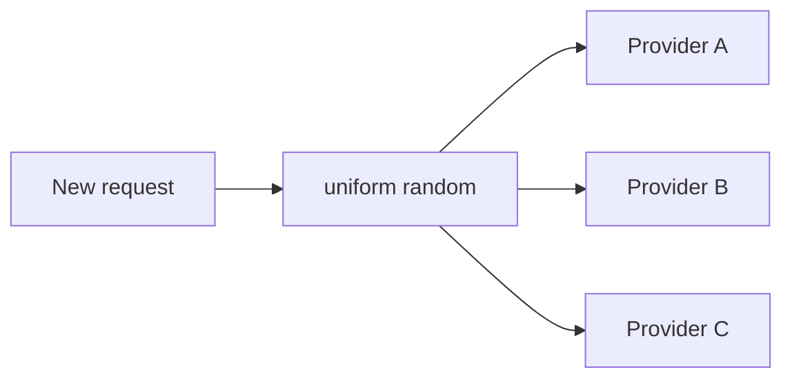

Configuration:

```yaml
apiVersion: grid.praxis-proxy.io/v1alpha1
kind: GridNetwork
metadata:
  name: random-provider-grid
spec:
  routingPolicy: geographyFirst
  scoringPolicy:
    strategy: noMetrics
  selectionPolicy:
    mode: random
```

Important behaviors:

- Admission and selection groups are evaluated first.
- Every eligible provider in the active group has equal probability.
- Random state is local to each gateway.
- Session affinity is checked before random selection.

**Demo coverage:** there is not currently a dedicated random-selection demo in `praxis-proxy/demos` or `praxis-proxy/experimental`.

---

# 5. Weighted-random selection

Use this when the need is:

> Send more new requests to providers with greater configured capacity.

Weighted random samples providers according to explicit relative weights inside the active group.

```text
Provider A capacityWeight: 50
Provider B capacityWeight: 30
Provider C capacityWeight: 20

Expected long-run new-request distribution:
A ~ 50%
B ~ 30%
C ~ 20%
```

The values are relative weights, not guaranteed percentages.

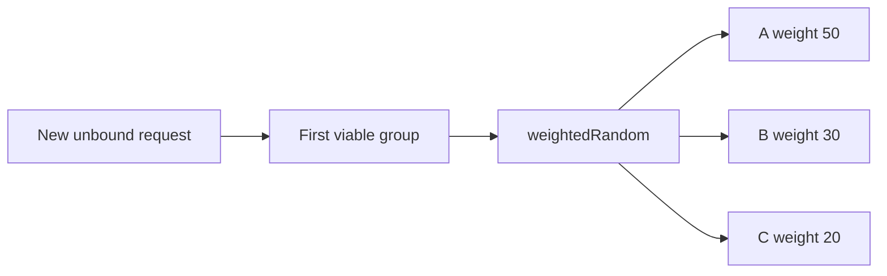

GridNetwork:

```yaml
apiVersion: grid.praxis-proxy.io/v1alpha1
kind: GridNetwork
metadata:
  name: weighted-grid
spec:
  routingPolicy: scoreFirst
  scoringPolicy:
    strategy: noMetrics
  selectionPolicy:
    mode: weightedRandom
  placementPolicy:
    strategy: static
```

Provider A (partial resource):

```yaml
apiVersion: grid.praxis-proxy.io/v1alpha1
kind: InferenceProvider
metadata:
  name: provider-a
spec:
  gridNetworkRef: weighted-grid
  capacityWeight: 50
```

Provider B and C would use their own `capacityWeight` values.

Important behaviors:

- `capacityWeight` accepts integers from `1` through `1000` and defaults to
  `1` when omitted. Grid copies it directly to the overlay's relative
  `traffic_weight`; it does not normalize the value or convert it to a
  percentage.
- Static weighted selection does not derive weight from a score.
- Weights do not override eligibility, admission, affinity, or selection-group precedence.
- With `geographyFirst`, a high-weight remote provider is still fallback while a closer group is viable.
- With `scoreFirst`, providers from different sites can share the active group and participate in the same weighted draw.
- Statistical results converge over sufficient traffic; a small sample should not be expected to match the configured ratio exactly.

**Demonstrated by:**

- [Grid Static and Dynamic Weighted Routing](https://github.com/praxis-proxy/experimental/tree/main/demos/grid-weighted-dynamic-routing)

The demo explicitly distinguishes two statuses:

- **Static weighted selection:** merged/mainline behavior.
- **Metric-driven dynamic weighting:** experimental.

For the field definition and overlay contract, see the
[CRD Reference](architecture/crds.md) and
[Routing Architecture and Overlay Contract](architecture/routing.md).

---

# 6. Load-aware provider preference

Use this when the need is:

> Prefer provider pools with more available serving capacity.

There is **not** a `selectionPolicy.mode: loadAware`.

Load awareness is a separate scoring dimension. Mainline Grid currently exposes provider-level scoring strategies such as:

- `queueDepth`
- `kvCachePressure`

The scoring strategy changes provider score/order. The selection mode still determines how requests are chosen inside the active group.

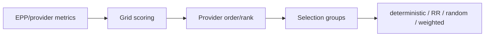

## Queue-depth preference

Use this when the need is:

> Prefer the provider pool with the shortest normalized queue.

```yaml
apiVersion: grid.praxis-proxy.io/v1alpha1
kind: GridNetwork
metadata:
  name: queue-aware
spec:
  routingPolicy: scoreFirst
  scoringPolicy:
    strategy: queueDepth
  selectionPolicy:
    mode: deterministic
  metricsRefreshInterval: "10s"
```

A provider also needs comparable metrics configuration; the following is a
partial `InferenceProvider.spec.metricsConfig` fragment:

The metric names below are an example mapping, not a universal llm-d metric
contract. Check the deployed exporter's `/metrics` output and configure the
exact names and pool labels it exposes. Names vary between scheduler versions
and metric adapters; a wrong name can leave Grid without the selected signal.

```yaml
spec:
  metricsConfig:
    metricsEndpoint: http://llmd-epp-metrics.inference.svc:9090
    path: /metrics
    timeout: 2s
    poolName: llama-70b-east
    queueCapacity: 64
    staleMetricsSeconds: 30
    signalNames:
      queueDepth: inference_pool_average_queue_size
      kvCacheUtilization: inference_pool_average_kv_cache_utilization
      healthy: inference_pool_ready_pods
```

Conceptually:

```text
score = 1 - normalized_queue_depth
```

Lower queue pressure produces the higher provider preference score.

## KV-cache pressure preference

Use this when the need is:

> Prefer the provider pool with more free KV-cache capacity.

```yaml
apiVersion: grid.praxis-proxy.io/v1alpha1
kind: GridNetwork
metadata:
  name: kv-aware
spec:
  routingPolicy: scoreFirst
  scoringPolicy:
    strategy: kvCachePressure
  selectionPolicy:
    mode: deterministic
```

Conceptually:

```text
score = 1 - kv_cache_utilization
```

This is **provider-level capacity pressure**, not request-specific prefix-cache affinity. Request-specific prefix/cache-aware endpoint selection belongs in the provider-local inference scheduler such as llm-d/EPP.

## Scores are not weights

This is critical:

```text
score != traffic weight
```

If:

```text
Provider A score = 0.8
Provider B score = 0.4
```

that does **not** mean A receives twice as many requests.

For example:

```yaml
routingPolicy: scoreFirst
scoringPolicy:
  strategy: queueDepth
selectionPolicy:
  mode: roundRobin
```

can still give equal turns to A and B when they are both in the same active group.

If the desired behavior is "pick the least-pressured provider," pair score-driven ordering with `deterministic`.

If the desired behavior is "change proportional traffic share based on live pressure," that is **dynamic weighting**, which is a different capability.

**Demonstrated by:**

- [Grid LLM-d Pool Metrics Demo](https://github.com/praxis-proxy/demos/tree/main/demos/grid-llmd-pool-metrics)

The demo has both `queueDepth` and `kvCachePressure` configurations with `routingPolicy: scoreFirst` and shows provider rank changing as pressure changes.

---

# 7. Dynamic pressure-based weighting - experimental

Use this when the desired need is:

> Keep several providers active but continuously reduce the traffic share of providers under greater pressure.

This differs from mainline metric scoring.

Mainline metric scoring changes **preference/order**.

Dynamic weighting changes **traffic share**.

```text
queue / KV pressure
        |
effective available capacity
        |
dynamic traffic weights
        |
weighted selection
```

The experimental three-pool demo uses the simplified model:

```text
available capacity = configured capacity * (1 - normalized pressure)
traffic share = provider available capacity / group available capacity
```

The demo is designed to exercise the end-to-end chain:

```text
reported metric
    |
calculated weight
    |
routing-overlay revision
    |
Praxis accepted/serving revision
    |
measured request distribution
```

**Status:** experimental. Do not document a pressure-weighted placement CRD as stable/mainline unless the current source and generated CRD schema confirm it.

**Demonstrated by:**

- [Grid Static and Dynamic Weighted Routing](https://github.com/praxis-proxy/experimental/tree/main/demos/grid-weighted-dynamic-routing)

---

# 8. Session affinity

Use this when the need is:

> Keep an established conversation or application session on the same provider while that provider remains eligible for existing work.

Session affinity is evaluated **before** a new provider selection.

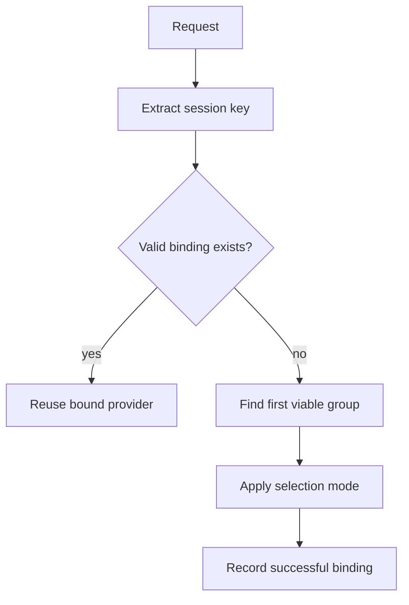

Session affinity belongs to the Praxis AI `intelligent_route` request-time configuration rather than the Grid scoring policy.

Example using a header:

```yaml
- filter: intelligent_route
  overlay_file: /etc/praxis/routing/routing-overlay.json
  session_affinity:
    enabled: true
    header: x-session-id
    ttl_secs: 3600
```

Example using a cookie:

```yaml
- filter: intelligent_route
  overlay_file: /etc/praxis/routing/routing-overlay.json
  session_affinity:
    enabled: true
    cookie: praxis-session
    ttl_secs: 3600
```

Behavior:

- Existing permitted binding: reuse the provider.
- No binding: run normal group + selection-mode logic and record the successful binding.
- Provider becomes `existing_only`: an already-bound session may continue when permitted, but new sessions are not placed there.
- Provider becomes excluded/ineligible: affinity cannot override the hard boundary; a fresh selection is required.

Because affinity is resolved first, round-robin or weighted traffic may not look exactly even when individual sessions generate different amounts of traffic.

Affinity entries are held in each Praxis process. A session key arriving at
another consumer gateway is not guaranteed to find the same entry. Use
appropriate ingress affinity when cross-request provider stickiness is required.

**Demonstrated by:**

- [Grid GLB Demo](https://github.com/praxis-proxy/demos/tree/main/demos/grid-glb-demo): separate edge and provider affinity, provider withdrawal, recovery, and failback.
- [Grid Combined-Site Demo](https://github.com/praxis-proxy/demos/tree/main/demos/grid-combined-site): existing-session behavior during local-provider withdrawal.

**Praxis AI reference:**

- [intelligent_route filter](https://github.com/praxis-proxy/ai/blob/main/docs/filters/intelligent_route.md)

---

# 9. Admission and failover

Use this when the need is:

> Stop placing new work on a provider that is unhealthy or under sustained pressure without necessarily breaking existing sessions immediately.

Admission is a harder boundary than score or weight.

Conceptually:

| Admission semantics understood by Praxis | New requests | Existing affinity |
|---|---:|---:|
| `new_and_existing` | yes | yes |
| `existing_only` | no | yes, when permitted |
| `none` | no; removed from eligible candidates | no |

Current Grid removes excluded providers before publishing its overlay. The
`none` value remains part of the generic Praxis overlay contract; Grid does not
emit it for excluded candidates today.

Neither a high score nor a high static weight can make an excluded provider eligible.

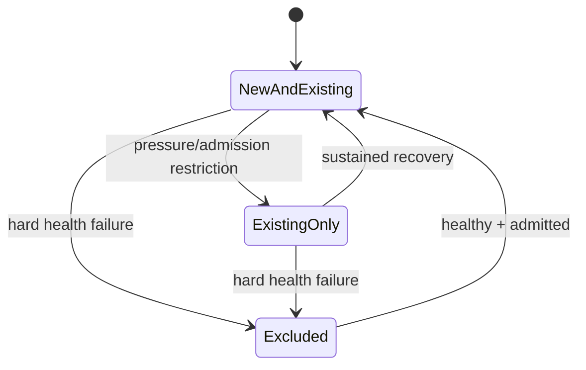

Selection groups turn this admission behavior into structured failover.

To opt into stabilized admission for configured metrics, set the policy
explicitly. If `pressure` is omitted, Grid uses the six values shown below as
defaults. If `pressure` is supplied, all six fields are required; durations
must be positive whole seconds (for example, `10s`). This example sets them
explicitly so the transition behavior is reviewable:

```yaml
apiVersion: grid.praxis-proxy.io/v1alpha1
kind: GridNetwork
metadata:
  name: stabilized-admission
spec:
  scoringPolicy:
    strategy: queueDepth
  admissionPolicy:
    mode: stabilized
    missingMetrics: existingOnly
    pressure:
      enterThreshold: 0.85
      exitThreshold: 0.70
      failureThreshold: 2
      successThreshold: 3
      minimumStateDuration: 10s
      recoveryHoldDown: 30s
---
apiVersion: grid.praxis-proxy.io/v1alpha1
kind: InferenceProvider
metadata:
  name: queue-aware-provider
spec:
  gridNetworkRef: stabilized-admission
  providerKind: self_hosted
  backendKind: local
  endpoint: http://inference.example.svc:8080
  models:
    - name: example-model
  metricsConfig:
    metricsEndpoint: http://metrics.example.svc:9090
    path: /metrics
    queueCapacity: 64
    signalNames:
      queueDepth: inference_pool_average_queue_size
```

`missingMetrics` can instead be `excluded`. When `admissionPolicy` is omitted,
Grid retains its instantaneous compatibility behavior. Hard health failure
still excludes a provider immediately; pressure hysteresis controls the
admission transition for otherwise healthy providers.

For pressure observations, also configure `scoringPolicy.strategy` on the
GridNetwork and the matching signal name in every participating provider's
`metricsConfig.signalNames`, with a reachable metrics endpoint. For raw queue
counts, set `queueCapacity` to normalize the value. For KV-cache pressure, map
`kvCacheUtilization`. Without an active strategy and matching provider signal,
Grid treats admission as not configured and leaves otherwise healthy
providers `new_and_existing`; the thresholds above alone do not enable
load-aware admission.

Example:

```text
Group 0: local Grid providers
Group 1: remote Grid providers
Group 2: external providers
```

A new request uses Group 0 while it has an eligible candidate. It falls through to Group 1 only when Group 0 cannot serve new work, and to Group 2 only when the earlier groups cannot.

**Demonstrated by:**

- [Grid Regional Failover and Cloud Burst](https://github.com/praxis-proxy/experimental/tree/main/demos/grid-cloud-burst): local backend failure, site failure, pressure-driven `existing_only`, cross-site fallback, and external overflow.
- [Grid Combined-Site Demo](https://github.com/praxis-proxy/demos/tree/main/demos/grid-combined-site): local withdrawal and remote failover.
- [Grid Workload Inference Demo](https://github.com/praxis-proxy/demos/tree/main/demos/grid-workload-inference): explicit provider withdrawal and recovery.

The cloud-burst demo is an experimental integration demo. Its current behavior is **group fallback**, not gradual percentage-based cloud bursting.

Failover takes effect after health observation, reconciliation, overlay
delivery, and acceptance by Praxis. A request can still fail against a provider
in the previous snapshot during that interval. Group fallback does not imply
automatic retry of a request already sent upstream; retry behavior must be
configured separately.

---

# 10. Dynamic reload

Use this when the need is:

> Change routing state without restarting Praxis or putting Grid in the request path.

Grid publishes a new content-addressed overlay when provider state, configuration, metrics, or remote Grid state changes.

Praxis validates the new overlay and atomically swaps the accepted in-memory snapshot.

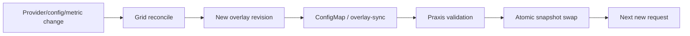

Praxis AI overlay mode:

```yaml
- filter: intelligent_route
  overlay_file: /etc/praxis/routing/routing-overlay.json
  reload:
    enabled: true
    debounce_ms: 500
```

Key properties:

- In-flight requests continue using the snapshot they already loaded.
- New requests use the new snapshot after successful validation.
- Invalid updates retain the last-known-good in-memory snapshot.
- Overlay reload changes candidate/routing state, but it does not dynamically add arbitrary new load-balancer clusters or TLS endpoints that were never configured in the running pipeline.
- A Kubernetes `ConfigMap` projection must not use `subPath` for the watched overlay file because `subPath` bypasses the normal atomic projection update mechanism.

**Demonstrated by:**

- [Grid GLB Demo](https://github.com/praxis-proxy/demos/tree/main/demos/grid-glb-demo)
- [Grid Combined-Site Demo](https://github.com/praxis-proxy/demos/tree/main/demos/grid-combined-site)

For the full revision lifecycle (rendered, distributed, accepted, and serving), see [Routing Architecture and Overlay Contract](architecture/routing.md).

---

# 11. Common routing profiles

|Routing policy|Deterministic|Round robin / random|Weighted random|
|---|---|---|---|
|`geographyFirst`|Top-ranked provider in the closest viable group.|Share within the closest viable group.|Weighted share within the closest viable group.|
|`scoreFirst`|Top-ranked fresh, admitted provider across sites.|Share across fresh, admitted providers.|Weighted share in the active cross-site group.|

All modes honor eligibility, admission, and affinity. Weighted mode requires
static placement and provider `capacityWeight`; all modes act only inside the
first viable group.

The YAML blocks in this section are partial `GridNetwork.spec` fragments unless
marked otherwise; merge them into the existing resource rather than applying
them as standalone manifests.

These profiles show how the dimensions compose.

## Keep traffic local and balance evenly

Need:

> Use nearby healthy providers evenly. Use remote providers only as fallback.

```yaml
spec:
  routingPolicy: geographyFirst
  scoringPolicy:
    strategy: noMetrics
  selectionPolicy:
    mode: roundRobin
```

Result:

```text
closest viable group
    A -> B -> C -> A ...

remote groups
    unused until the closer group is not viable
```

Best demonstrations:

- [Grid Combined-Site](https://github.com/praxis-proxy/demos/tree/main/demos/grid-combined-site)
- [Grid Workload Inference](https://github.com/praxis-proxy/demos/tree/main/demos/grid-workload-inference)

## Cross-site active/active

Need:

> Let healthy providers in different sites share traffic.

```yaml
spec:
  routingPolicy: scoreFirst
  scoringPolicy:
    strategy: noMetrics
  selectionPolicy:
    mode: roundRobin
```

Result:

```text
fresh + admitted providers across sites
            |
       one active group
            |
       equal selections
```

## Prefer the least-queued pool

Need:

> Route new requests to the provider pool with the best currently observed queue score.

```yaml
spec:
  routingPolicy: scoreFirst
  scoringPolicy:
    strategy: queueDepth
  selectionPolicy:
    mode: deterministic
  metricsRefreshInterval: "10s"
```

Best demonstration:

- [Grid LLM-d Pool Metrics](https://github.com/praxis-proxy/demos/tree/main/demos/grid-llmd-pool-metrics)

## Static capacity-weighted active/active

Need:

> Give larger provider pools a larger share of new traffic.

```yaml
spec:
  routingPolicy: scoreFirst
  scoringPolicy:
    strategy: noMetrics
  selectionPolicy:
    mode: weightedRandom
  placementPolicy:
    strategy: static
```

Provider examples:

```yaml
# Provider A
# Partial InferenceProvider.spec fragment
spec:
  capacityWeight: 50
```

```yaml
# Provider B
# Partial InferenceProvider.spec fragment
spec:
  capacityWeight: 30
```

```yaml
# Provider C
# Partial InferenceProvider.spec fragment
spec:
  capacityWeight: 20
```

Best demonstration:

- [Grid static weighted provider qualification](../tests/e2e/topologies/grid-static-weighted/README.md)
  (stable, in-repository)
- [Grid dynamic weighted routing](https://github.com/praxis-proxy/experimental/tree/main/demos/grid-weighted-dynamic-routing)
  (experimental pressure-derived weights)

## Sticky sessions with local-first routing

Need:

> Keep sessions stable while retaining local-first failover.

GridNetwork:

```yaml
spec:
  routingPolicy: geographyFirst
  scoringPolicy:
    strategy: noMetrics
  selectionPolicy:
    mode: roundRobin
```

Praxis AI:

```yaml
- filter: intelligent_route
  overlay_file: /etc/praxis/routing/routing-overlay.json
  session_affinity:
    enabled: true
    header: x-session-id
    ttl_secs: 3600
```

Best demonstration:

- [Grid GLB Demo](https://github.com/praxis-proxy/demos/tree/main/demos/grid-glb-demo)

---

# 12. Demo-to-capability map

The demos are runnable examples of the routing model. Check each demo's pinned
sources, prerequisites, and qualification results before treating it as release
evidence; experimental demos can require APIs absent from mainline Grid.

| Demo | Repository | Routing behavior it demonstrates |
|---|---|---|
| `grid-cloud-burst` | [experimental](https://github.com/praxis-proxy/experimental/tree/main/demos/grid-cloud-burst) | Site-local selection groups, round robin, geography-first preference, queue-driven admission, regional fallback, external overflow, hot reload. Experimental integration. |
| `grid-weighted-dynamic-routing` | [experimental](https://github.com/praxis-proxy/experimental/tree/main/demos/grid-weighted-dynamic-routing) | Static weighted random, three-provider proportional selection, hot reload, and experimental pressure-driven dynamic weights. |
| `grid-distributed-token-rate-limit` | [experimental](https://github.com/praxis-proxy/experimental/tree/main/demos/grid-distributed-token-rate-limit) | Round-robin provider selection after quota admission; request-time routing remains local to Praxis. |
| `grid-llmd-pool-metrics` | [demos](https://github.com/praxis-proxy/demos/tree/main/demos/grid-llmd-pool-metrics) | `queueDepth`, `kvCachePressure`, `scoreFirst`, dynamic provider re-ranking, pressure and recovery. |
| `grid-glb-demo` | [demos](https://github.com/praxis-proxy/demos/tree/main/demos/grid-glb-demo) | Session affinity, provider withdrawal/recovery, hot reload, and separation of edge selection from Grid provider selection. |
| `grid-combined-site` | [demos](https://github.com/praxis-proxy/demos/tree/main/demos/grid-combined-site) | Local-first routing, remote fallback, existing-session behavior, and recovery. |
| `grid-workload-inference` | [demos](https://github.com/praxis-proxy/demos/tree/main/demos/grid-workload-inference) | Workload-originated local-first routing, health-based failover, and recovery. |
| `grid-route53-edge-entry` | [demos](https://github.com/praxis-proxy/demos/tree/main/demos/grid-route53-edge-entry) | Independent public-edge selection and private Grid provider selection; useful for understanding routing-layer composition. |

---

# 13. What Grid routing does not mean

## Grid provider selection is not llm-d pod selection

Grid selects a provider gateway/pool.

The provider-local serving stack can then independently choose a concrete inference endpoint or replica.

```text
Client
  |
Praxis consumer
  |
Grid/Praxis provider selection
  |
Praxis provider gateway
  |
llm-d / EPP endpoint selection
  |
vLLM replica
```

Request-specific prefix-cache affinity belongs at the provider-local scheduler where request and replica state are available.

## A score is not a percentage

Scores influence order and preference.

Weights influence proportional selection.

## A selection group is not a weight bucket

Selection groups define priority and fallback boundaries.

The picker runs only inside the first viable group.

## `noMetrics` does not disable intelligent routing

`noMetrics` disables dynamic metric scoring. Eligibility, health, admission, locality, freshness, affinity, selection groups, and selection mode still apply.

## Load-aware routing is not a selection mode

There is no stable `selectionPolicy.mode: loadAware`.

Use scoring to express provider-level load preference.

Dynamic pressure-derived traffic weighting is a separate experimental capability.

## Cloud burst is not one selection mode

The experimental cloud-burst demo composes:

- eligibility/admission;
- locality groups;
- provider health;
- queue pressure;
- first-viable-group fallback;
- external provider groups;
- normal request-time selection inside the chosen group.

Its validated cloud transition is currently hard/group fallback, not a claim of gradual percentage-based cross-tier bursting.

---

# 14. Control plane versus request path

Grid and Praxis intentionally split responsibilities.

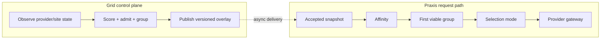

**Grid owns:**

- provider and site discovery;
- provider eligibility and admission;
- provider-level metric observation;
- score/order computation;
- selection-group construction;
- static traffic-weight publication;
- versioned overlay publication.

**Praxis AI owns:**

- accepted immutable routing snapshot;
- session affinity;
- first-viable-group resolution;
- deterministic, round-robin, random, and weighted-random selection;
- provider-cluster choice;
- atomic overlay hot reload.

**Provider-local inference systems own:**

- pod/replica-level endpoint scheduling;
- request-specific prefix/cache-aware scheduling;
- inference-engine internals.

The result is that sophisticated routing policy can change asynchronously without introducing a distributed control-plane lookup into every inference request.

---

# References

Grid:

- [Grid repository](https://github.com/praxis-proxy/grid)
- [Grid documentation index](README.md)
- [Routing Architecture and Overlay Contract](architecture/routing.md)
- [Provider Scoring](architecture/scoring.md)
- [CRD Reference](architecture/crds.md)

Praxis AI:

- [`intelligent_route` filter](https://github.com/praxis-proxy/ai/blob/main/docs/filters/intelligent_route.md)

Runnable demos:

- [Praxis demos](https://github.com/praxis-proxy/demos/tree/main/demos)
- [Praxis experimental demos](https://github.com/praxis-proxy/experimental/tree/main/demos)
